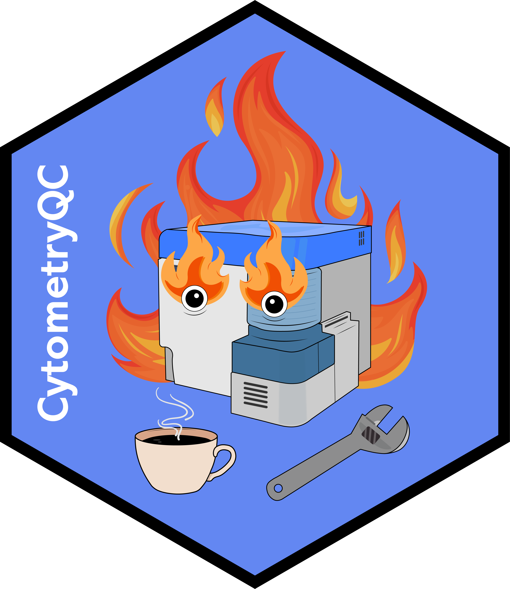

# Welcome to `CytometryQC` 

<!-- To modify Package/Title/Description/Authors fields, edit the DESCRIPTION file -->
<!-- badges: start -->

[-blue.svg)](https://cran.r-project.org/web/licenses/AGPL%20(%3E=%203))
[](https://github.com/DavidRach/Luciernaga)
[](https://github.com/DavidRach/Luciernaga)
[](https://github.com/DavidRach/CytometryQC/commits/main)

<br> <!-- badges: end -->

## `CytometryQC`: You get a QC website, you get a QC website, everyone gets a QC website.

Building off infrastructure used to build the [UMGCCFCSS InstrumentQC](https://umgccfcss.github.io/InstrumentQC/index.html) website, this R package generalizes and automates the process to allow other flow cytometry cores to quickly generate equivalent InstrumentQC webpages for their own respective instruments. 

### Installation

To begin, you will need to ensure you have the correct software required on each individual computer. Please read our [GettingStarted](https://davidrach.github.io/CytometryQC/articles/GettingStarted.html) vignette and make sure to get everything installed.

Once this is done, you will need to install both Luciernaga and CytometryQC R packages from GitHub. 

``` r
if(!require("remotes")) install.packages("remotes")

remotes::install_github("https://github.com/DavidRach/Luciernaga")

remotes::install_github("https://github.com/DavidRach/CytometryQC")

library(Luciernaga)
library(CytometryQC)
```

### Get Started

Once required software and packages are installed, please read the [Getting Started](https://davidrach.github.io/CytometryQC/articles/GettingStarted.html) vignette. 

### Contribute

Our original website was designed around use for both Cytek and BD instruments. It can be relatively easily customized to instruments from other manufacturers where QC .fcs files have been acquired daily. If you are interested in helping get these cytometers from other manufacturers set up as default options, please reach out, the more help the merrier. 

### Found a bug? Report it!

Encountered what you expect is a bug? We've caught quite a few, but since everyone's computer set up is different, there are still a few unknown ones we haven't encountered during testing. Please report it [here](https://github.com/DavidRach/CytometryQC/issues) and together we can make this open-source project better. 
